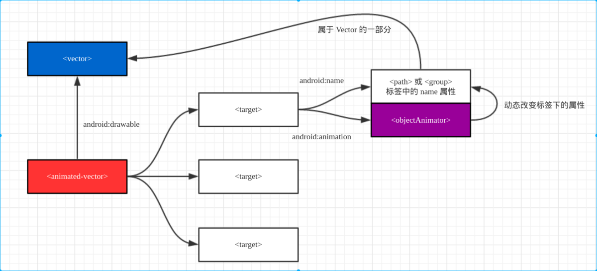

# VectorDrawable和AnimatedVectorDrawable详解

## 1. Vector的优点

**VectorDrawable** 主要有两个优点：屏幕**自适应**和**体积小** 
* 如果使用普通的png和jpg图片，那么为了能让图片在不同的分辨率上能够很好地展现，通常会在各个drawable文件夹下放置不同分辨率的图片文件，而VectorDrawable则不需要，仅仅只使用一套资源，就能适应任何分辨率的手机。
* 对于某些图片，VectorDrawable素材的大小要比png和jpg小很多。

## 2. SVG和Vector的基本概念
* **SVG**：全称**可缩放矢量图形**，它不是Android平台特有的概念，简单来说，就是用于描述二维矢量图形的图形格式。
* **VectorDrawable**：它是SVG在Android中的实现，并不支持SVG的全部语法，只支持部分有必要的部分。

## 3. 获取VectorDrawable
1. 俗话说的好，巧妇难为无米炊，那么如何获得一个VectorDrawable，一般获取的方式有以下三种方式：
* 网站直接下载SVG图像
* 由UI设计师使用专业的工具导出
* 通过[**VectorMagic**](https://vectormagic.com/)软件

2. SVG转Vector
在Android Studio的File->New->Vector Asset选项中选择Local File，并打开我们下载后的图像，在选择Next保存到指定文件夹。最后就会得到一个*.xml文件，这个就是VectorDrawable。
```xml
<vector xmlns:android="http://schemas.android.com/apk/res/android"
        android:height="24dp" 
        android:viewportHeight="1024.0"
        android:viewportWidth="1024.0" 
        android:width="24dp">
        
        <path 
        android:fillColor="#FF000000" 
        android:pathData="M887.9,298.2c-12.9,-12.1 -33.2,-11.5 -45.2,1.4L415.9,754l-233.1,-229.7C170.2,511.9 150,512 137.5,524.6c-12.4,12.6 -12.3,32.9 0.4,45.2l256.5,252.7c0.1,0.1 0.2,0.1 0.3,0.2 0.1,0.1 0.1,0.2 0.2,0.3 2,1.9 4.4,3 6.8,4.3 1.2,0.7 2.1,1.7 3.4,2.1 3.8,1.5 7.8,2.2 11.7,2.2 4.2,0 8.4,-0.8 12.3,-2.5 1.3,-0.5 2.3,-1.7 3.6,-2.4 2.4,-1.4 4.9,-2.6 6.9,-4.7 0.1,-0.1 0.1,-0.3 0.2,-0.4 0.1,-0.1 0.2,-0.1 0.3,-0.2l449.2,-478.2C901.4,330.6 900.8,310.3 887.9,298.2z"/>
    </vector>
```

## 4. Vector语法
1. 虽然说大多数情况下，我们不会完全手动去编写Vector的xml文件，但是，对于Vector的基本语法还是有必要了解一些的，因为在我们后边谈到的动态Vector中需要了解对于每个标签有哪些属性可以设置，Vector包含下面三种标签：
```xml
<vector>
    <group>
        <path/>
        <path/>
    </group>
<!--    
<vector xmlns:android="http://schemas.android.com/apk/res/android"  //命名空间
    android:height="200dp"  //这个是图片的intrinsic高度 dp/px
    android:width="200dp"   //这个是图片的intrinsic宽度
    android:viewportHeight="100"    //这个是为这个图片设置的纵坐标,表示将图片分为100等份,主要下面的pathData需要依赖这个坐标的划分
    android:viewportWidth="100"     //同上,只不过这个是横坐标,这两个值可以随便定
    android:alpha="0.2"     //这个是整个图像的透明度,取值范围0到1
    >

    <group      //这个标签中可以放入若干个<path/>标签,并给它们设置一些共同的属性
        android:name="group_name"   //这个name很有用,在设置objectAnimator的时候用来区分给那个部分施加动画
        android:pivotY="50"     //这个设置这个group的中心点的X坐标,取值范围为0到100,在做rotation时有用
        android:pivotX="50"     //这个设置这个group的中心点的Y坐标,取值范围为0到100,在做rotation时有用
        android:translateX="20" //将整个group在X轴方向平移多少像素
        android:translateY="30" //将整个group在Y轴方向平移多少像素
        android:rotation="90"   //将整个group以中心点左边旋转的角度,360为一圈
        android:scaleX="0.5"    //横坐标的缩放比例 , 取值1表示100%
        android:scaleY="0.3">   //纵坐标的缩放比例,取值0.5表示50%,取值1.5表示150%

        <path   //这个标签是重头戏,矢量图绘制的路径
            android:name="path_name"    //为这个path标记的名字,在使用objectAnimator的时候用来区分给哪个部分施加动画

            android:pathData="m 0,0 L50,0 L100,100 L0,100 z"    //类似Canvas中的Path

            android:fillColor="@color/red"  //图形内部的夜色
            android:fillAlpha="1"       //图形的透明度取值范围0到1
            android:strokeAlpha="0.5"   //线条的透明度,取值范围0到1
            android:strokeColor="#ff0000ff" //线条的颜色
            android:strokeLineCap="butt|round|square"   //线的末端形状,butt严格到指定的坐标就截至,round圆角的先端边缘,square方形的边缘不过有点向外延伸
            android:strokeLineJoin="round|bevel|miter"  //线的连接处形状,round是圆角的,bevel和miter貌似看不出来有什么区别....
            android:strokeWidth="20"    //线段的宽度

            android:trimPathStart="0.5"    //顾名思义,从path开始的地方(0%)去除path,去除到指定的百分比位置,取值范围0到1
            android:trimPathEnd="0.5"      //顾名思义,从path结束的地方(100%的地方)去除path,去除到指定的百分比位置,取值范围0到1
            android:trimPathOffset="0.5"   //这个属性是和上面两个属性共同使用的,单独使用没有用,这个属性的意思是,在去除path的时候设置path原点的位置,按百分比设置,取值范围0到1
            />
    </group>
</vector>
-->
</vector>

```
group标签的作用有两个:

* 对Path进行分组，由于我们后面需要针对Path进行动画，所以可以让具有同样动画效果的Path在同一个Group中
* 拓展动画效果，单个的path标签是没有translateX和translateY属性的，因此无法使用属性动画来控制path translateY，而group标签是有的，所以我们需要先将相关的path标签元素包裹在一个个的group标签中.

2. Path指令解析
    1. 支持的指令：

    M = moveto(M X,Y) ：将画笔移动到指定的坐标位置  
    L = lineto(L X,Y) ：画直线到指定的坐标位置  
    H = horizontal lineto(H X)：画水平线到指定的X坐标位置  
    V = vertical lineto(V Y)：画垂直线到指定的Y坐标位置  
    C = curveto(C X1,Y1,X2,Y2,ENDX,ENDY)：三次贝赛曲线  
    S = smooth curveto(S X2,Y2,ENDX,ENDY)  
    Q = quadratic Belzier curve(Q X,Y,ENDX,ENDY)：二次贝赛曲线  
    T = smooth quadratic Belzier curveto(T ENDX,ENDY)：映射  
    A = elliptical Arc(A RX,RY,XROTATION,FLAG1,FLAG2,X,Y)：弧线  
    Z = closepath()：关闭路径  

    2. 使用原则:

        1. 坐标轴为以(0,0)为中心，X轴水平向右，Y轴水平向下  
        2. 所有指令大小写均可。大写绝对定位，参照全局坐标系；小写相对定位，参照父容器坐标系
        3. 指令和数据间的空格可以省略
        4. 同一指令出现多次可以只用一个  
        
    `注意，’M’处理时，只是移动了画笔， 没有画任何东西。 它也可以在后面给出上同时绘制不连续线。`  
关于这些语法，开发者需要的并不是全部精通，而是能够看懂即可，其它的都可以交给工具来实现。

## 5.Vector的兼容性问题

为了让VectorDrawable能够在**Android 5.0**以下版本的手机上使用，我们需要引入**support**包，并修改**gradle**的配置。

* 引入support包
VectorDrawable是在Android 5.0之后提出的，因此，如果我们需要在低版本上使用，就要要求版本号大于等于`23.2.0`

```
compile 'com.android.support:appcompat-v7:25.3.1'
```

* 修改gradle配置

```
<!--gradle 版本小于2.0-->
android {
    defaultConfig {
        // Stops the Gradle plugin’s automatic rasterization of vectors
        generatedDensities = []
    }
    // Flag to tell aapt to keep the attribute ids around
    aaptOptions {
        additionalParameters "--no-version-vectors"
    }
}

<!--gradle 版本大于2.0-->
android {
    defaultConfig {
         vectorDrawables.useSupportLibrary = true
    }
}
```

* 同时确保使用**AppCompatActivity**，而不是Activity

## 6.静态VectorDrawable
静态的Vector图像，就可以在控件中使用

> 可以发现，这里我们使用的都是普通的ImageView，好像并不是AppcomatImageView，  
> 这是因为使用了Appcomat后，系统会自动把ImageView转换为AppcomatImageView。

* ImageView\ImageButton  

对于ImageView这样的控件，要兼容Vector图像，只需要将之前的`android:src`属性，换成`app:srcCompat`即可
```xml
<ImageView
    android:id="@+id/iv"
    android:layout_width="wrap_content"
    android:layout_height="wrap_content"
    app:srcCompat="@drawable/vector_image"/>
```
在代码中设置
```android
ImageView iv = (ImageView) findViewById(R.id.iv);
iv.setImageResource(R.drawable.vector_image);
```

* Button
Button并不能直接使用app:srcCompat来使用Vector图像，需要通过Selector来进行使用，首先，创建两个图像，用于Selector的两个状态，

selector1.xml
```xml
<vector xmlns:android="http://schemas.android.com/apk/res/android"
        android:width="24dp"
        android:height="24dp"
        android:viewportHeight="24.0"
        android:viewportWidth="24.0">
    <path
        android:fillColor="#FF000000"
        android:pathData="M14.59,8L12,10.59 9.41,8 8,9.41 10.59,12 8,14.59 9.41,16 12,13.41 14.59,16 16,14.59 13.41,12 16,9.41 14.59,8zM12,2C6.47,2 2,6.47 2,12s4.47,10 10,10 10,-4.47 10,-10S17.53,2 12,2zM12,20c-4.41,0 -8,-3.59 -8,-8s3.59,-8 8,-8 8,3.59 8,8 -3.59,8 -8,8z"/>
</vector>
```
selector2.xml
```xml
<vector xmlns:android="http://schemas.android.com/apk/res/android"
        android:width="24dp"
        android:height="24dp"
        android:viewportHeight="24.0"
        android:viewportWidth="24.0">
    <path
        android:fillColor="#FF000000"
        android:pathData="M11,15h2v2h-2zM11,7h2v6h-2zM11.99,2C6.47,2 2,6.48 2,12s4.47,10 9.99,10C17.52,22 22,17.52 22,12S17.52,2 11.99,2zM12,20c-4.42,0 -8,-3.58 -8,-8s3.58,-8 8,-8 8,3.58 8,8 -3.58,8 -8,8z"/>
</vector>
```
selector.xml
```xml
<?xml version="1.0" encoding="utf-8"?>
<selector xmlns:android="http://schemas.android.com/apk/res/android">
    <item android:drawable="@drawable/selector1" android:state_pressed="true"/>
    <item android:drawable="@drawable/selector2"/>
</selector>
```
非常简单，只是把普通的Selector中的图像换成了Vector图像而已，接下来，在Button中使用这个Selector即可：  
```xml
<Button
    android:id="@+id/btn"
    android:layout_width="70dp"
    android:layout_height="70dp"
    android:background="@drawable/selector"/>
```

在Activity的前面使用
```java
static {
    AppCompatDelegate.setCompatVectorFromResourcesEnabled(true);
}
```
开启这个flag后，你就可以正常使用Selector这样的DrawableContainers了。同时，你还开启了类似android:drawableLeft这样的compound drawable的使用权限，以及RadioButton的使用权限，以及ImageView’s src属性。

* RadioButton
```xml
<RadioButton
    android:layout_width="50dp"
    android:layout_height="50dp"
    android:button="@drawable/selector"/>
```

## 7.动态VectorDrawable

动态VectorDrawable，也就是AnimatedVectorDrawable，一般来说，它的结构如下：  
  

为了实现动态的VectorDrawable，一般需要提供三种类型的*.xml文件，这三个xml文件的根标签分别为：
* **vector**：图像资源，也就是静态vector，定义于`res/drawable`文件夹下。
* **objectAnimator**：定义图像资源中每个元素的动画行为，定义与`res/animator`文件夹下。
* **animated-vector**：对vector中的元素与**objectAnimator**进行组合，定义与`res/drawable`文件夹下。
```xml
<animated-vector
    xmlns:android="http://schemas.android.com/apk/res/android"
    android:drawable="@drawable/ic_arrow">
<!--name属性，就是在静态Vector图像中group或者path标签的name属性-->
    <target
        android:name="left"
        android:animation="@animator/anim_left"/>

    <target
        android:name="right"
        android:animation="@animator/anim_right"/>

</animated-vector>
```

```xml
<objectAnimator
    xmlns:android="http://schemas.android.com/apk/res/android"
    android:duration="1000"
    android:interpolator="@android:interpolator/anticipate_overshoot"
    android:propertyName="translateX"
    android:repeatCount="infinite"
    android:repeatMode="reverse"
    android:valueFrom="0"
    android:valueTo="-10"
    android:valueType="floatType"/>
```
代码中使用
```
ImageView imageView = (ImageView) findViewById(R.id.iv);
AnimatedVectorDrawableCompat animatedVectorDrawableCompat = AnimatedVectorDrawableCompat.create(
        this, R.drawable.square_anim
);
imageView.setImageDrawable(animatedVectorDrawableCompat);
((Animatable) imageView.getDrawable()).start();
```

-----

### 制作Vector  
有些工具可以根据图片自动提取矢量图数据。但是这里需要实现变形动画，就需要每个状态的路径个数是一样的。而且Android只支持SVG规范中的一部分内容。

1. 在线将简单的普通图片装换为Android Vector Drawable，开源 [**svg2android**](https://github.com/inloop/svg2android)  工具[**svg2android**](http://inloop.github.io/svg2android/ )

2. 使用 开源[**SVGO**](https://github.com/svg/svgo)  工具[**SVGOMG**](https://jakearchibald.github.io/svgomg/) 工具把导出的SVG文件处理一下方便在Android上使用。

3. SVG在线编辑器 [**ac**](http://editor.method.ac/) 编写

4. 使用Android Studio的Vector Asset，进行创建Vector图像，还可以直接通过本地的SVG图像生成Vector图像。
### 制作动画

开源[**ShapeShifter**](https://github.com/alexjlockwood/ShapeShifter)  工具[**Icon Animatior**](https://romannurik.github.io/AndroidIconAnimator/)工具来制作动画。  
1. 首先把第一个 SVG 文件导入进去。然后点击该文件图层上的 秒表 图标，然后添加一个新的 pathData 动画。
然后会显示一个输入路径信息的界面，然后在 toValue 中输入路径下一个状态信息。然后重复创建这个状态的动画，最后一个路径信息和第一个是一样的，形成一个循环。


[Vector的动画Demo库](https://github.com/xuyisheng/VectorDemo)

----
# Vector的性能
1.  Bitmap的绘制效率并不一定会比Vector高，它们有一定的平衡点，  
    当Vector比较简单时，其效率是一定比Bitmap高的，  
    所以，为了保证Vector的高效率，Vector需要更加简单，PathData更加标准、精简，  
    当Vector图像变得非常复杂时，就需要使用Bitmap来代替了
2.  Vector适用于ICON、Button、ImageView的图标等小的ICON，  
    或者是需要的动画效果，由于Bitmap在GPU中有缓存功能，而Vector并没有，  
    所以Vector图像不能做频繁的重绘
3. Vector图像过于复杂时，不仅仅要注意绘制效率，初始化效率也是需要考虑的重要因素
4. SVG加载速度会快于PNG，但渲染速度会慢于PNG，  
    毕竟PNG有硬件加速，但平均下来，加载速度的提升弥补了绘制的速度缺陷。
